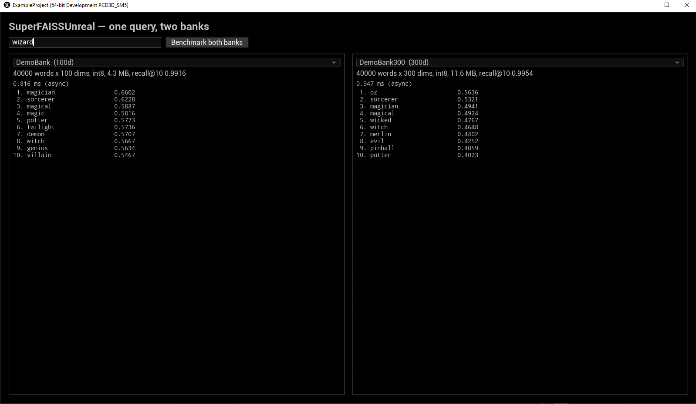

# SuperFAISS For Unreal Engine

Fast, deterministic, allocation-free k-nearest-neighbor search for Unreal Engine
5.8+ — over banks you import as assets or grow at play time. One
`USuperFAISSVectorBank`/`USuperFAISSScratchBank` pair answers many questions:
whole-vector similarity or any weighted mix of named channels, decomposition bars
for *why* each hit ranked, gameplay state folded into the ranking in-scan,
prototype categories pooled from selected rows, with the quantization cost measured and stored on every
bank asset. Exact, bit-deterministic per device, and (opt-in) bit-identical across
machines. This is the reference engine integration of the MIT-licensed
[SuperFAISS](https://github.com/dansupergameprogrammer/superfaiss) core
library (vendored — no external dependency).

SuperFAISS is an **independent implementation** — not a fork of, derived from, or
affiliated with Meta's FAISS; the name is nominative homage.

Embeddings turn meaning into geometry: words, NPC memories, items, sounds — anything an
encoder model can vectorize — become points where *similar means near*. This plugin
answers "what's most similar to this?" exactly, in microseconds, on any thread.

Measured on the shipped demo bank (40,000 words x 100 dims, int8, ~4 MB), desktop
editor: single query **0.13 ms** (auto-parallelized across chunks — the core's serial
one-core scan of the same bank is ~0.65 ms), batched **0.06 ms per query** — exact
search, bit-deterministic, zero steady-state allocation.

**New in 3.2:** the **Bank Inspector** — reading a bank's structure, not only
querying it. Three header-only core modules over a caller-held view: a mutual k-NN
neighbour graph with connected components (which rows cluster, and which sit alone);
a two-limb novelty test that combines an exact metric-distance identity check with a
rank against a calibrated baseline, verdicting a probe row `duplicate`, `familiar` or
`novel`; and sampled mutual correspondence between two banks with CSLS margins (which
rows in A answer to rows in B). An editor tab drives all three over a bank asset or a
serialized scratch archive, with a PCA scatter beside them. Every pass is sampled and
discloses its coverage, and these modules are **per-device** deterministic — the
cross-device claim covers the query path, not the inspection passes, and the panel says
so. Adds an Insights instrumentation bar (named trace scopes, stat counters, a CSV
category, bookmarks) whose non-perturbation is asserted by test, not by claim. The
allocation guarantee is now enforced rather than stated: every public entry point
carries an allocation cell under a raw-allocation tracking seam, and a registry check
fails the build when a new entry point arrives without one. Bundles the MIT core
library at `v3.2.0`.

**New in 3.1:** a runtime-mutable channel vocabulary. `Relabel` re-partitions the
channel table on a live scratch bank — add or remove channels, change their count
*and* boundaries, or promote a single-space bank to channels and demote it back —
without a rebuild. The rows are unchanged; only the partition moves. It is exclusive
like `Grow`/`Load` (it drains in-flight queries) and reject-over-degrade (a malformed
table leaves the bank exactly as it was), and a relabeled bank scores identically to a
fresh bank created under the new table over the same rows. The Blueprint channel-scratch
surface completes alongside it — named-channel scratch queries, per-channel scratch
recall, and the channel vocabulary surviving a save/load round trip — as do read-only
MCP closures of the analytics reductions (spread and mean/max nearest-neighbour) over a
live snapshot. Includes a segmented-kernel AVX2 fix (a length-4 channel could score a
spurious `0` on the AVX2 float path). Bundles the MIT core library at tag `v3.1.2`.

**New in 3.1.2:** a release-hardening point, prompted by an external review. Fixes the
Win64 **Shipping** game build (a missing `MassEntityQuery.h` include in the demo module's
swarm processor — Editor PCH masked the IWYU gap); scrubs stale public contracts that
survived 3.1 (the scratch channel table is mutable via `Relabel`, and scratch channel
queries resolve — headers, `API.md`, and `INTEGRATION.md` now say so); documents `Relabel`
in the core API/integration docs; corrects the core version header (it still reported
3.0.1); narrows the plugin README's portability claim to the surfaces actually verified;
and syncs every version surface to 3.1.2.

**New in 3.0.1:** version-header fix (the `SUPERFAISS_VERSION_*` macros now report
3.0.1) and a zero-energy Cosine channel edge: a channel that carries no energy on a
valid (whole-row-normalized) row now floors to a defined `0` in the NN-divergence
reductions — consistent with the centroid/spread reductions and the documented
contract — and the per-channel recall / freeze-with-recall audit skips such a
sampled row instead of aborting. Bundles the MIT core library at tag `v3.0.1`.

**New in 3.0:** channel-capable scratch banks and channel-scoped analytics —
channels (the named sub-space partition baked banks have carried since 2.0) extend
to the mutable half. `InitWithChannels` fixes a channel table on a scratch bank at
construction; a named-channel scratch query ranks a snapshot by a weighted
combination of channels and agrees **bit-for-bit** with its baked twin; channel-aware
`Freeze` graduates the bank to a schema-2 channel bank, and per-channel recall audit
reports recall@k per channel. Every 2.5 analytics operator gains a channel-scoped
form (BP and read-only MCP) — "this mind's *identity* is drifting but its *appearance*
is stable" is a channel-scoped centroid distance. Append-time-only cost (the Cosine
per-channel sub-norm), never on the query path. Built on the MIT core library at tag
`v3.0`.

**New in 2.5:** bank analytics — cross-device-deterministic reductions over int8
banks: a set-to-set centroid distance (drift over checkpoints is that operator
between two checkpoints' row sets), directed nearest-neighbour set divergence (mean,
and the order-free max that is the Hausdorff component), within-bank dispersion, and
the shared query-vs-query pair score they rest on — all bit-identical across machines
by the same integer-accumulation proof as the query path, on the Blueprint subsystem
and (read-only) as MCP tools. Plus an offline per-device probe-direction projection
report. The editor's **Bank Inspector** (Tools > SuperFAISS Bank Inspector) shows a
live PCA projection beside its ranked-query view. Result-direction convention (a `Dot`
bank returns a similarity, not a distance) and the cosine limb's determinism condition
are stated in the docs.

**New in 2.4:** integer-domain pooling — `MakeCentroidQueryCrossDevice` pools int8
rows into a **quantized** cross-device query (order-free integer accumulation, no
float mean), so pooled queries honestly participate in cross-device-exact results;
`QueryPooledCrossDevice` executes exactly those bytes, and the editor bakes the
same operator's product into cross-device-tier prototype assets (baked anchor
byte-equals a runtime pool over identical rows, behind a required asset version
bump). Pooled recall is measured beside the operator and stated with its
conditions in the plugin README.

**New in 2.3:** scratch-bank recall audit — an opt-in float-retention posture on
scratch banks (never the default; the memory cost is stated plainly) plus
`MeasureRecall`, reporting the bank's own cross-device recall with a seed, a
generation stamp, and a stale mark; any later append, remove, or load marks the
report stale, never silently current. `DescribeScratchBank` (MCP) reports it
read-only.

**New in 2.2:** cross-device bit-exactness — an opt-in query mode (int8 banks)
returning bit-identical scores and hit order on any machine at any SIMD width,
the contract lockstep/rollback multiplayer and networked motion matching
require. The claim runs as a CI test against committed fixtures, it measures
faster than the default int8 scan, and the importer reports the mode's recall
beside standard recall on every bank asset.

**New in 2.1:** per-row score bias, in-scan and exact — sparse (index, bias) pairs
for motion matching's continuing-pose reward (effectively free) and a dense per-row
view for memory salience (+3.5% f32 / +1.9% int8, measured). Finite-only; exclusion
beats bias; rewards are negative on L2.

**New in 2.0:** named channels (rank by a weighted combination of vector sub-spaces,
with exact per-channel decomposition of every hit and true per-channel cosines) and
scratch banks (mutable runtime banks — append/remove/query/freeze/save — for NPC
memory and session-accumulated embeddings). Channels are a semantics feature, not a
speed feature: a channel query costs approximately one full scan, and the docs say
so plainly. See the [plugin README](SuperFAISSUnreal/README.md).



The editor **Bank Inspector** (Tools > SuperFAISS Bank Inspector) reads a bank's
structure rather than only querying it: mutual k-NN clustering, a novelty verdict
for a probe row against a calibrated baseline, mutual correspondence between two
banks with CSLS margins, and a PCA projection — over a bank asset or a serialized
scratch archive. Every pass is sampled and says so, and the per-device determinism
scope is stated in the panel itself.


## Repo layout

| Path | What |
|---|---|
| `SuperFAISSUnreal/` | The plugin. Copy this folder into your project's `Plugins/`. |
| `SuperFAISSUnrealMCP/` | Optional MCP toolset: enumerate, describe, query, import, validate, and lint tools over your banks. Requires Experimental engine plugins most distributions don't carry — see its README. Disabled by default; everything else works without it. |
| `ExampleProject/` | Minimal host project; opens straight into the demo map. |

## Try it

1. Clone. Open `ExampleProject/ExampleProject.uproject` (UE 5.8+; the project finds
   the plugin in the repo root via `AdditionalPluginDirectories`). Build when prompted.
2. The editor opens on the demo map. Play in editor, type a word at it.

Or headless, from the repo root:

```
UnrealEditor-Cmd ExampleProject/ExampleProject.uproject -ExecCmds="Automation RunTests SuperFAISS; Quit" -unattended -nullrhi
```

104 automation tests (108 with the MCP toolset plugin enabled): kernel correctness,
SIMD/scalar mirror equality, determinism, tie-break stability, concurrency, asset
round-trips, import rejection, quantizer recall, performance guards, query composition
(centroid, direction, intersection, margins), named-channel queries and decomposition,
per-row bias, scratch banks, **channel-capable scratch banks (v3.0) — a named-channel
scratch query proven bit-equal to its baked twin, channel-aware freeze to a schema-2
bank, per-channel recall, the composition set (bias / cross-device / tombstone), and
the rejection catalog; channel-scoped analytics; the channel-scratch linter**,
cross-device exactness (v2.2 — including a golden-hash battery over committed fixtures
that must match the core CI's pin), bank analytics (set-to-set distance,
drift/divergence/spread, projection — v2.5), bank lint analyses, prototype authoring, a
golden semantic query on the demo bank, and the Mass swarm's stability.

## Use it in your project

Copy `SuperFAISSUnreal/` into `<YourProject>/Plugins/` and enable it. The plugin is
self-contained (the core library is vendored inside), has no platform allowlist, and
depends only on stable engine modules (the demo module adds Slate/InputCore and
Mass — UE 5.8 engine modules, no plugin references — and is strippable in three
steps) — see the [plugin README](SuperFAISSUnreal/README.md) for
the API quick start, bank authoring, guarantees, and demo-strip steps.

**Designed for portability, verified on one target.** No platform code, no platform
allowlist — SIMD is selected automatically. What is *verified* today: the plugin on
UE 5.8 Win64 (Editor + automation suite + Shipping game build); the vendored core's own
CI additionally covers Windows/Linux (AVX2, TSan) and Apple Silicon NEON. Other UE
targets should work by construction but have not been qualified.

## Engine versions

Developed and tested on UE 5.8. The code surface is deliberately conservative —
engine subsystem, `ParallelFor`/task graph, standard UObject serialization, Slate —
so older engines are expected to be a recompile, with two version-sensitive points:

- The Build.cs files set `FPSemantics = FPSemanticsMode.Precise`, which the
  determinism guarantee requires (source pragmas do not stop clang FP contraction).
  Engines predating that UBT property need an equivalent per-module precise-FP flag.
- The shipped `Content/Demo` assets are saved by UE 5.8 and will not load in older
  engines (UE packages are not backward-compatible). Regenerate them locally:
  bake a bank from any sidecar-format source with `-run=SuperFAISSUnrealBake`
  (the shipped bank uses [GloVe](https://nlp.stanford.edu/projects/glove/) 6B 100d),
  then rebuild the demo map with `-run=SuperFAISSUnrealDemoMap`.
- The example project's `BuildSettingsVersion`/`EngineAssociation` may need a
  per-version bump.

## The original pitch

v1.0's opening pitch, word for word:

> Fast, deterministic, allocation-free k-nearest-neighbor search over baked embedding
> banks, for Unreal Engine 5.8+. This is the reference engine integration of the
> MIT-licensed [SuperFAISS](https://github.com/dansupergameprogrammer/superfaiss) core
> library (vendored — no external dependency).

Every word still holds — the plugin just answers more questions now. The banks no
longer have to be baked (scratch banks grow during play and survive save games),
and one bank now serves channel-weighted queries, decomposition, in-scan bias,
prototype categories, and honest per-bank recall numbers alongside the plain top-k
it started with.

## Licensing

- Plugin and example project: MIT (see `LICENSE`).
- SuperFAISS core: MIT (`SuperFAISSUnreal/Source/ThirdParty/SuperFAISS/LICENSE`).
- Demo bank vectors: GloVe (Pennington, Socher, Manning; Stanford NLP), Public Domain
  Dedication and License v1.0.
